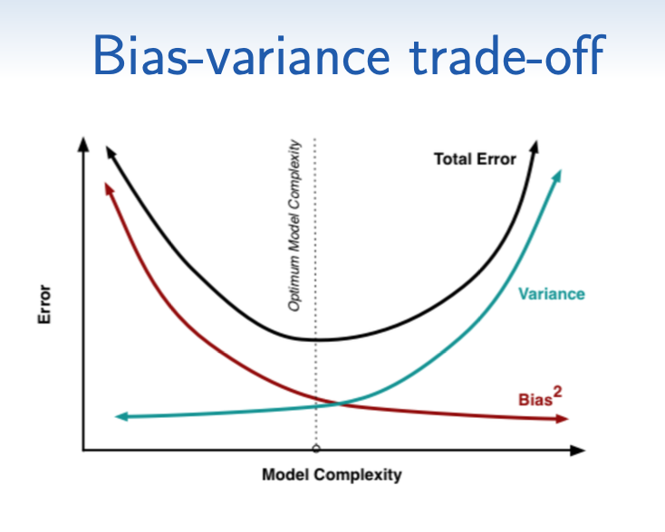
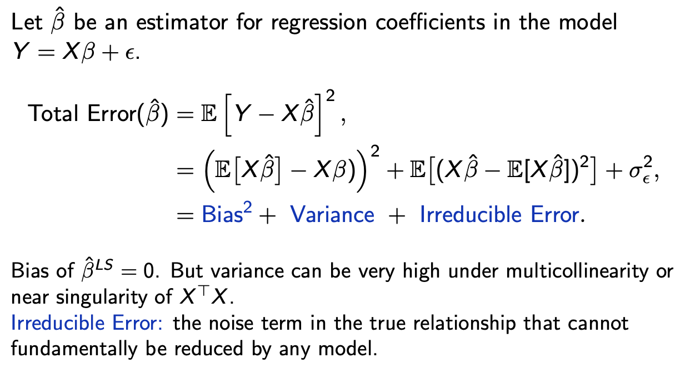
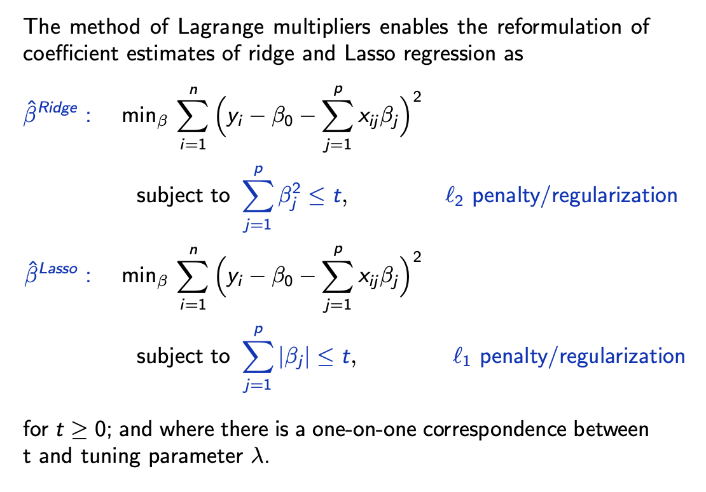
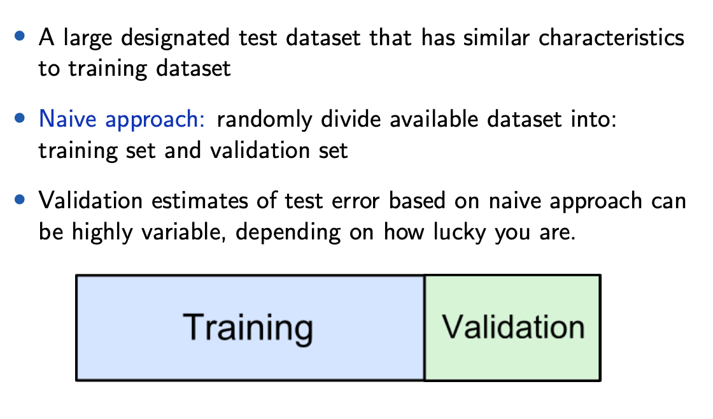

# Lecture 1

***All visualisations are in bold***

## Descriptive Statistics
- Continuous, e.g. trip distance, trip amount
- Discrete, e.g., passenger count
*both continuous and discrete are numerical*
- Categorical, e.g., payment type

### Types of Descriptive Statistics
Measures of
- frequency --> how often something occurs
- central tendency (mean / median / mode) --> use when want to show average or most commonly indicated response
- dispersion or variation (range (=max-min) variance / standard deviation / skew) --> use to show how spread the data is
- association (covariance, (Pearson) correlation, MI, **scatterplots**)
e.g., for MVN need vector mean and covariance matrix
PCA is a method to represent the original dependent variances using some new, transformed independent variables

Model: input --> output; want to know which features are most likely to affect 

Key characteristics
- Do the values tend to cluster around a particular point
- Is there more than one cluster? Multimodel?
- Variability in the values / how quickly do the probabilities drop off as we move away from the modes?
- Outliers: are there extreme values in the data?

## Machine Learning
*Want to make predictions with unseen inputs*
Most relationships are stochastic; this state of uncertainty is due mainly to the present of
- latent factors on which y depends but that are not observed or measured (hidden variables)
- measurement noise

## Prediction
- A prediction rule or relationship produces a predictor (mathematically defined). A predictor is not random

## Supervised vs Unsupervised Learning
- 

# Lecture 2

# Lecture 3

## Linear Model
- Useful for predicting continuous response
- Response variable ($y_i\in\mathbb{R}$) and $p$-dimensional vector of predictor / input / design variables
- Given $n$ samples $\{\bm{x}_i, y_i\}^n_{i=1}$, we want to approximate the response $y_i$ based on the predictor variables
$$
y_i=\bm{x}_i^T\bm{\beta}+\epsilon_i
$$
where $\beta=(\beta_0,\ldots,\beta_p)^T, E(\epsilon_i)=0, \text{var}(\epsilon_i)=\sigma^2$ (all errors independent).
- Want to estimate $\bm{\beta}$ and $\sigma^2$

## OLS
$x=1$

## Assumptions and how to check them
1. Predictors are accurately observed
2. Linear relationship between response and predictors
3. Independent errors and constant variance
4. $X$ is of full rank (need $X^TX$ to be invertible). Generally this means we need more observations than parameters

## LS: Asymptotic
Recall that $\hat\beta_{LS}=(X^TX)^{-1}X^T\bm{y}$
- Gauss-Markov theorem implies $\hat\beta_{LS}$ has the smallest MSE of all estimators with no bias
- Consistency: $\hat\beta_{LS}\to\beta$ in probability
- Asymptotic normality: $\hat\beta_{LS}\overset{d}{\approx}N(\cdot,\cdot)$ by CLT

## Interpreting regression coefficients
- 1 unit increase in $x_1$ corresponds to an estimated $\hat\beta_1$ (unit) increase in the response
- But $\hat\beta$ changes with sampling variation
- If $\beta_1$ is plausibly 0, then we say $x_1$ is a statistically insignificant feature

## Feature Selection
### Why?
- Model is more interpretable and explainable, e.g. doctors cannot remember effects of 50 variables, but maybe 3 or 4
- Higher predictive accuracy: the presence of a large number of insignificant variables may mask the effect of actually significant variables
- Faster computation

## Approaces to feature selection

### Stepwise regression
We wish to perform statistical test for each parameter ($H_0:\beta_j=0$ vs $H_1:\beta_j\neq0$)

### T-test
- t-test: under $H_0$, $\frac{\hat\beta_j}{\sqrt{v_j}\hat\sigma}\sim t_{n-p-1}$
- Reject according to rejection region of $t_{n-p-1}$
- This test the usefulness of $x_j$ in the presence of other predictors in the model
- We are testing the marginal effect: $y_i=\beta_0+\beta_jx_{ij}+\epsilon_i$, so must be careful when features are 
- May need to use PCA to get independent predictors

### F-test
- Can use F test to compare two nested models

### Goodness-of-fit
Reminder: two tasks
1. Model Selection
2. Parameter estimation (only once you have selected the model you want to estimate!)

- Can use goodness-of-fit measures to perform model selection. These do not require
    - $R^2$: 
    - AIC, BIC: 
        - Want to select the model with the smalleer AIC or BIC (they are just relative measures)

### Best subset regression
Challenges of model selection
- Simply applying tese criterion for an exhaustive search is computationally expensive, even for moderately large $p$, e.g., $p=10, k=7\implies {10\choose 7}=120$ candidates
- How to find a good model?

### Bias Variance Tradeoff
Sometimes we wish to introduce bias to reduce variance. We want to reduce bias AND variance to reduce the overall error.

To the left of optimal is underfit; to the right of optimal is overfit.

### Regularisation (penalised regression)
Perform linear regression while shrinking or penalising the parameters towards 0. Therefore, these methods perform model selection automatically.

**Ridge regression**
$$
\hat\beta_{\text{ridge}}=\argmin_\beta \left(SS_{Reg}(\beta)+\lambda\sum_{j=1}^p \beta_j^2 \right)
$$
To find this, we minimise
$$
\min_\beta \left(\sum_{i=1}^n (y_i-\beta_0-\sum_{j=1}^p x_{ij}\beta_j) +\lambda\sum_{j=1}^p \beta_j^2\right) \\
\iff \\
SS_{Reg}(\beta, \lambda) = (y-X\beta)^T(y-X\beta)+\lambda\beta^T\beta \\
\iff \\
\hat\beta_{\text{ridge}}=(X^TX+\lambda I_p)^{-1}X^Ty
$$
- as $\lambda\to 0$, ridge estimates go to least squares estimates
- as $\lambda\to\infty$, ridge estiamtes go to 0
- determine $\lambda$ is important and difficult; use cross-validation
- $\beta_0$ is NOT penalised
- must scale before regularising, including ridge (*standardisation*)

**LASSO (Least Absolute Shrinkage and Selection Operator)**
- Unlike ridge regression, LASSO reduces parameters to 0
- Hence can act as a selection operator for which parameters are important
- Again, $\lambda$ is the tuning parameter
$$
\hat\beta_{\text{LASSO}}=\argmin_\beta \left(SS_{Reg}(\beta)+\lambda\sum_{j=1}^p |\beta_j| \right)
$$
To find this we minimise
$$
\min_\beta \left(\sum_{i=1}^n (y_i-\beta_0-\sum_{j=1}^p x_{ij}\beta_j) +\lambda\sum_{j=1}^p |\beta_j|\right)
$$
If $X^TX=I$ then the solution can be written as 
$$
\hat\beta_{\text{ridge}}=\text{sgn}(\hat\beta_j^{(LS)})\left(|\hat\beta_j^{(LS)}|-\frac{\lambda}{2}\right)
$$

Regularisation is a process of introducing additional information to solve an ill-posed problem or to prevent overfitting
- Pros
    - Lower computational cost than best subset / stepwise regression selection
    - Feasible for ultra high dimensional problems
- Cons
    - Estimates are sensitive to choice of $t$ and $\lambda$
    - Does not do well when true values of parameters are large and most features are signficant
    - Coefficients are biased

# Lecture 4

- Reliable approach: k-fold cross validation (CV)
- Rigorous approach: repeated k-fold cross validation (CV) (changing splits), but computationally expensive
